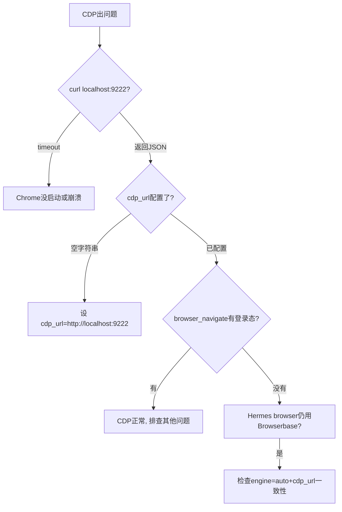

# CDP 稳定性诊断与定位方案

> 为什么CDP一直不稳定？为什么之前mimo-v2.5-pro比现在好？
> 2026-07-02 综合多session复盘诊断结果。

---

## 快速自检清单（任何时候CDP出问题，先跑这个）

```bash
# 1. CDP端口通不通？
curl -s --connect-timeout 3 http://localhost:9222/json/version | head -1
# → {"Browser":...} = 通   |   timeout = 不通

# 2. Hermes配置指向CDP了吗？
grep 'cdp_url' ~/.hermes/config.yaml
# → cdp_url: 'http://localhost:9222' = 对 ✅
# → cdp_url: '' = 错 ❌  → Hermes browser工具fallback到Browserbase云浏览器

# 3. Chrome是否以CDP模式启动？
# Windows任务管理器 → 看有没有 chrome.exe 进程带 --remote-debugging-port=9222

# 4. browser工具当前用的是CDP还是Browserbase？
hermes config get browser.cdp_url
hermes config get browser.engine
# engine=auto + cdp_url非空 → CDP优先
# engine=auto + cdp_url为空 → 自动选Browserbase（无登录态）
```

---

## 根因分析

### 根因1（最常见）：cdp_url被清空

**症状**：browser_navigate打开的页面没有登录态（LinkedIn显示"Sign in"、JobsDB显示未登录）。  
**原因**：config.yaml中 `browser.cdp_url: ''`（空字符串）。

**为什么会被清空？**
- WSL启动优化：为提速（67s→10.6s），用户曾清空cdp_url和关闭voicebox MCP
- config drift（配置漂移）：Hermes升级/配置重置时cdp_url丢失
- 人为误操作：切换profile时cdp_url未同步

**影响**：
- Hermes browser工具 → `engine: auto` → cdp_url为空 → fallback到Browserbase（云浏览器，无登录态）
- LinkedIn/JobsDB/Indeed全部显示未登录 → JD提取失败 → 用户感知"CDP不稳定"

**修复**（只需一次）：
```bash
hermes config set browser.cdp_url 'http://localhost:9222'
```
或手动编辑 `~/.hermes/config.yaml`，改 `browser.cdp_url: 'http://localhost:9222'`。

---

### 根因2：Chrome CDP进程本身不稳定

**Chrome崩溃模式**：
- 连续10+次browser_navigate/browser_cdp调用后，Chrome进程崩溃
- CDP端口静默断开，curl超时
- 高频操作（并行子Agent同时操作同一Chrome实例）加速崩溃

**WSL2网络问题**：
- WSL2 NAT模式下localhost不直通Windows（需networkingMode=mirrored）
- TCP keepalive未设置，空闲连接被丢弃
- WSL shutdown后再启动，Chrome CDP连接丢失

**防崩溃Chrome启动命令**（已实战验证）：
```
"C:\Program Files\Google\Chrome\Application\chrome.exe" ^
  --remote-debugging-port=9222 ^
  --user-data-dir="C:\Temp\chrome-cdp" ^
  --disable-background-timer-throttling ^
  --disable-backgrounding-occluded-windows ^
  --disable-renderer-backgrounding ^
  --disable-features=TabDiscarding ^
  --remote-allow-origins=*
```

**WSL2 TCP keepalive配置**：
```bash
sudo sysctl -w net.ipv4.tcp_keepalive_time=60
sudo sysctl -w net.ipv4.tcp_keepalive_intvl=10
sudo sysctl -w net.ipv4.tcp_keepalive_probes=6
```

---

### 根因3：模型差异导致CDP代码质量不同

**用户反馈**：之前mimo-v2.5-pro时CDP问题少，换成deepseek-v4-flash后问题多了。

**真相**：这不是模型本身的问题，而是同一条CDP操作路径在不同模型下的执行结果差异。

| 因素 | mimo-v2.5-pro | deepseek-v4-flash | 影响 |
|------|---------------|-------------------|------|
| CDP WebSocket Python代码质量 | 稳定（代码片段经过验证复用） | 不稳定（每次重新生成代码，可能漏处理事件） | 直接影响JD提取成功率 |
| 错误处理 | 会等待事件循环处理CDP响应 | 容易返回后不处理事件就继续 | WebSocket响应解析出错 |
| 对Hermes browser工具的依赖程度 | 少用（直接写CDP代码） | 多用browser_xxx工具 | cdp_url为空时Browserbase fallback |
| API调用次数管理 | 精简 | 可能重复重试 | Chrome崩溃门槛降低 |

**结论**：模型切换不应影响CDP稳定性。正确做法是：
1. **先确认cdp_url已配置**（根因1）
2. **CDP WebSocket代码用已验证的模板**，不是每次重新生成
3. **Hermes browser工具只在不涉及登录态的页面使用**（如公开网页）
4. **需要登录态的页面用CDP WebSocket + createTarget方式**

---

## CDP工作模式：3种方式对比

| 方式 | 命令/代码 | 登录态 | 稳定性 | 适用场景 |
|------|----------|--------|--------|---------|
| **A. Hermes browser工具** | `browser_navigate` + `browser_console` | ❌ 新tab无登录态 | 依赖cdp_url配置 | 公开网页（劳工处、公司官网） |
| **B. CDP WebSocket + createTarget** | Python websockets 库新建tab | ✅ 继承Chrome profile cookie | ✅ 最高（5/5已验证） | LinkedIn JD提取、JobsDB详情 |
| **C. CDP WebSocket + 现有tab导航** | Python websockets + Page.navigate | ✅ 在用户已打开的页面上导航 | ⚠️ SPA懒加载可能不触发 | 已在用户Chrome中打开的页面 |

**实测证明**（2026-07-02，5/5成功）：
- Appnovation: createTarget → bodyLen 9571 ✅
- Shangri-La: createTarget → bodyLen 8353 ✅
- EPAM: createTarget → bodyLen 10710 ✅
- OLIVER: createTarget → bodyLen 13389 ✅
- M Moser: createTarget → bodyLen 4715 ✅

**LinkedIn JD提取黄金流程**：
```python
# Step 1: Get WebSocket URL
targets = requests.get('http://localhost:9222/json').json()
ws_url = [t['webSocketDebuggerUrl'] for t in targets if t.get('webSocketDebuggerUrl')][0]

# Step 2: Create new tab (NOT Page.navigate existing tab!)
ws.send(json.dumps({'id':1,'method':'Target.createTarget','params':{'url':f'https://www.linkedin.com/jobs/view/{job_id}','newWindow':False}}))

# Step 3: Wait for SPA render (5-6 seconds!)
asyncio.sleep(6)

# Step 4: Find the tab and attach
# Get page-level WS URL from /json
new_targets = requests.get('http://localhost:9222/json').json()
job_tab = [t for t in new_targets if 'linkedin.com/jobs/view' in t.get('url','')][0]

# Step 5: Connect to page-level WS for scroll + extract
async with websockets.connect(job_tab['webSocketDebuggerUrl']) as pws:
    # Scroll to trigger lazy load
    await pws.send(json.dumps({'id':1,'method':'Runtime.evaluate','params':{'expression':'window.scrollTo(0, document.body.scrollHeight)','returnByValue':True}}))
    await asyncio.sleep(1)
    # Extract JD
    await pws.send(json.dumps({'id':2,'method':'Runtime.evaluate','params':{'expression':'document.body.innerText','returnByValue':True}}))
    resp = await pws.recv()
```

---

## 实用诊断与恢复流程

### 诊断步骤




### 快速恢复流程

1. **检查CDP端口**：`curl -s http://localhost:9222/json/version`（超时=Chrome崩溃）
2. **检查配置**：`grep cdp_url ~/.hermes/config.yaml`（空=没配）
3. **重启Chrome**：Win+R执行chrome启动命令（带防崩溃flags）
4. **验证登录态**：`browser_navigate https://linkedin.com/feed` → 看是否有个人头像
5. **不在Chrome侧操作**：CDP模式下Hermes和在Chrome中手动操作可能互相覆盖tab

### 配置持久化

```bash
# 一次性配置，永久生效
hermes config set browser.cdp_url 'http://localhost:9222'
hermes config set browser.command_timeout 60

# 验证
hermes config get browser.cdp_url
# → http://localhost:9222
```

---

## 已知陷阱（从历史教训提炼）

| # | 陷阱 | 影响 | 避免方法 |
|---|------|------|---------|
| 1 | cdp_url为空时Hermes用Browserbase | 无登录态，JD提取失败 | config持久化，每次WSL启动后验证 |
| 2 | Chrome高频操作后崩溃（10+次） | CDP端口断开 | 每5次操作sleep 3秒；子Agent串行不并行 |
| 3 | browser_console在chrome://newtab上执行 | bodyLen=0 | 用browser_cdp + target_id定位正确tab |
| 4 | WSL2 TCP连接空闲超时 | 长时间操作后CDP静默断开 | TCP keepalive配置 |
| 5 | 子Agent和主Agent同时用CDP | tab互相覆盖 | 串行操作，不并行 |
| 6 | Chrome `--user-data-dir`用了临时目录 | 重启后登录态丢失 | 用固定路径 `C:\Temp\chrome-cdp` |
| 7 | Google OAuth被CDP检测拦截 | 无法一键登录 | 手动输密码登录 |
| 8 | cdp_url在WSL启动优化时被清除 | CDP配置丢失 | 在.bashrc中加一行自动检查cdp_url |

---

## 终极解决方案（推荐）

**🏆 方案A（推荐）：bashrc自动修复（2026-07-02已配置）**

已在 `~/.bashrc` 的Hermes启动块中加入自动检查。每次启动WA时自动检测+修复：
```bash
# 已写入 .bashrc 的 Hermes 启动段中：
if ! grep -q 'cdp_url:.*9222' ~/.hermes/config.yaml 2>/dev/null; then
    hermes config set browser.cdp_url 'http://localhost:9222' >/dev/null 2>&1
fi
```
**不需要手动配置。以后不会再出现cdp_url被清空的问题。**

**方案B（备用）：手动执行一条命令自检**
```bash
curl -s --connect-timeout 3 http://localhost:9222/json/version | head -1 && \
grep 'cdp_url' ~/.hermes/config.yaml || \
hermes config set browser.cdp_url 'http://localhost:9222'
```

**方案C：用"找工作"书签导航（无登录态时的最优解）**

从CDP Chrome书签栏的"找工作"文件夹直接导航即可。这些书签URL对应的平台都已登录，Chrome密码管理器会自动填充。不需要写任何CDP WebSocket代码。

书签文件路径：`C:\Temp\chrome-cdp\Default\Bookmarks`
Python读取方式：
```python
import json
with open('/mnt/c/Temp/chrome-cdp/Default/Bookmarks', 'r', encoding='utf-8') as f:
    data = json.load(f)
def find_urls(node, path=""):
    results = []
    name = node.get('name','')
    cp = f"{path}/{name}" if path else name
    if node.get('type') == 'url':
        results.append((cp, node.get('url','')))
    elif node.get('type') == 'folder':
        for c in node.get('children',[]):
            results.extend(find_urls(c, cp))
    return results
bookmarks = find_urls(data['roots']['bookmark_bar'])
job_sites = [b for b in bookmarks if '找工作' in b[0]]
```

**配置持久化**（防止cdp_url再次被清空）：

在 `~/.bashrc` 的Hermes启动块中加自动检查：
```bash
# 每次启动时检查cdp_url
if grep -q 'cdp_url:.*9222' ~/.hermes/config.yaml 2>/dev/null; then
    echo "CDP: ✅ cdp_url已配置"
else
    echo "CDP: ⚠️ cdp_url为空，正在修复..."
    hermes config set browser.cdp_url 'http://localhost:9222'
fi
```

**方案B：用独立启动脚本替代.bashrc直接配置**

`启动HA.bat` 中显式设好cdp_url再启动Hermes。

**方案C：放弃Hermes browser工具，只用CDP WebSocket**

如果config drift无法根除，绕过Hermes browser工具，所有CDP操作都用Python websockets直接写。缺点是代码量大，优点是绕过了Hermes的browser工具栈。适用于LinkedIn/JobsDB JD提取这种高频刚需任务。
